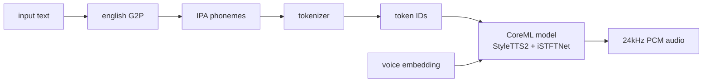
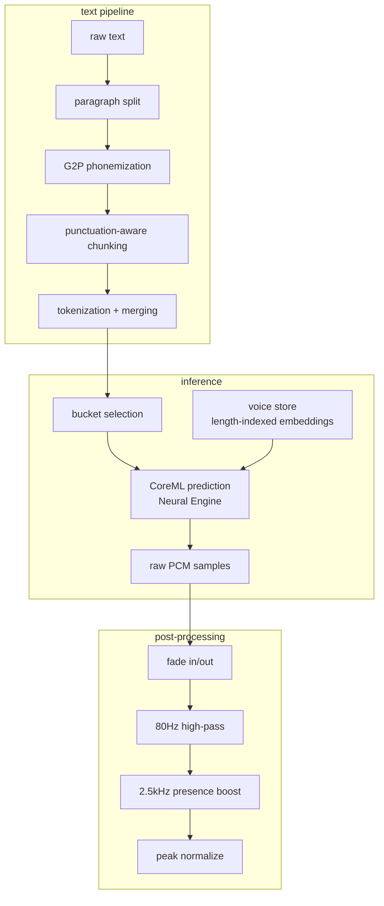

# kokoro-tts-swift

text-to-speech in Swift. give it text, get 24kHz audio back.

Kokoro-82M running on the Apple Neural Engine via CoreML. ~3.5x real-time on M-series. automatic chunking, voice style embeddings, speed control.

## install

```swift
// Package.swift
dependencies: [
    .package(url: "https://github.com/Jud/kokoro-tts-swift.git", from: "0.1.0"),
]
```

models (~640MB) are downloaded automatically on first use. you can also grab them manually:

```bash
./scripts/download-models.sh
```

## usage

```swift
import KokoroTTS

let engine = try KokoroEngine(modelDirectory: modelPath)
engine.warmUp()

let result = try engine.synthesize(text: "hello world", voice: "af_heart")
// result.samples → 24kHz mono PCM float array
// result.duration → audio length in seconds
// result.realTimeFactor → how much faster than real-time
```

speed control:

```swift
let slow = try engine.synthesize(text: "take your time", voice: "af_heart", speed: 0.7)
let fast = try engine.synthesize(text: "let's go", voice: "af_heart", speed: 1.5)
```

## CLI

install:

```bash
make install
```

usage:

```bash
kokoro-say "hello from the terminal"
kokoro-say -v am_adam -s 1.2 "speed it up"
kokoro-say -o output.wav "save to file"
echo "piped input" | kokoro-say
kokoro-say --list-voices
```

models are downloaded automatically on first run. use `--model-dir <path>` to override the default location.

run `kokoro-say --help` for all options.

## how it works



text goes through a rule-based english G2P pipeline -- lexicon lookup, letter-to-sound rules, number expansion. words not in the lexicon fall back to a [BART neural G2P](https://github.com/Jud/swift-bart-g2p) model. phonemes get tokenized and fed to the CoreML model alongside a voice style embedding.

the engine picks the smallest model bucket that fits your input:

| bucket | max tokens | audio length |
|--------|-----------|-------------|
| small  | 124       | ~5s         |
| medium | 242       | ~10s        |

longer text gets automatically chunked at sentence boundaries and stitched together with crossfades.

## architecture



## model

- **architecture**: Kokoro-82M (StyleTTS2 encoder + iSTFTNet vocoder, unified)
- **sample rate**: 24kHz mono
- **voices**: style embedding vectors, one JSON per voice preset
- **runtime**: CoreML on Apple Neural Engine (ANE), falls back to GPU/CPU
- **platform**: macOS 15+

## license

Apache 2.0
